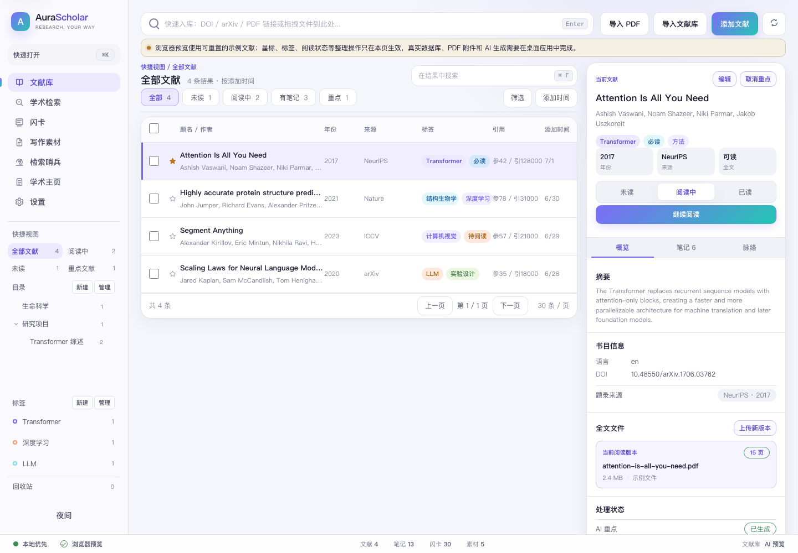
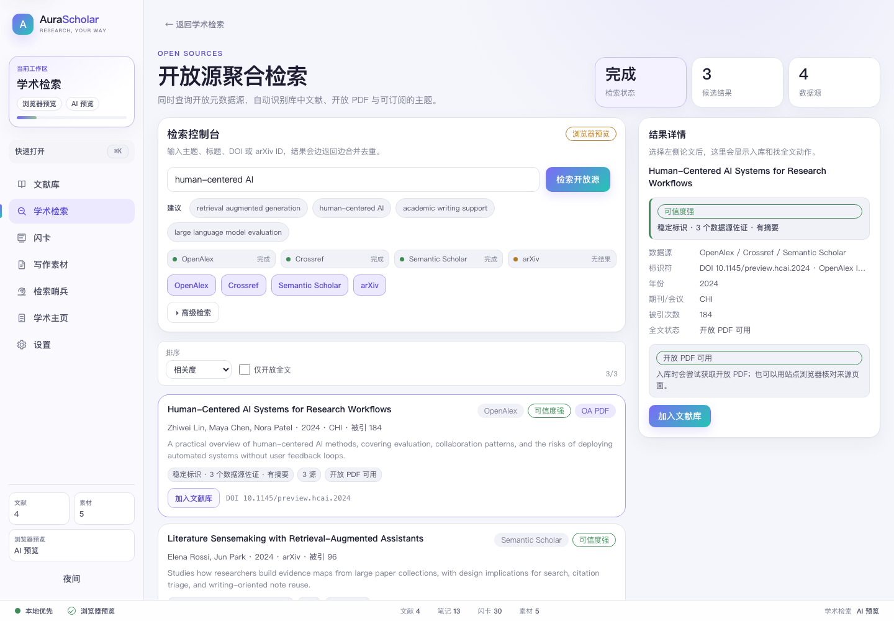
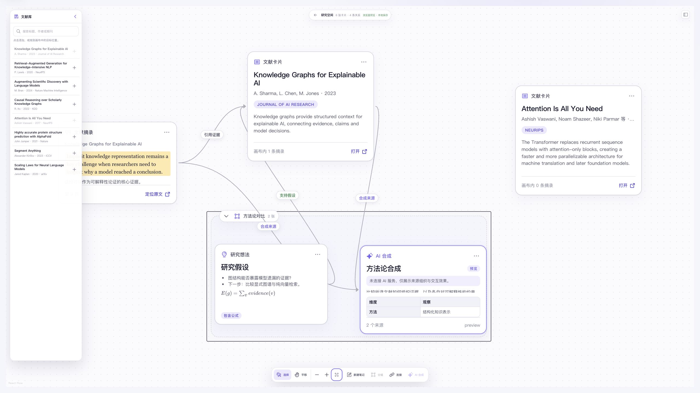
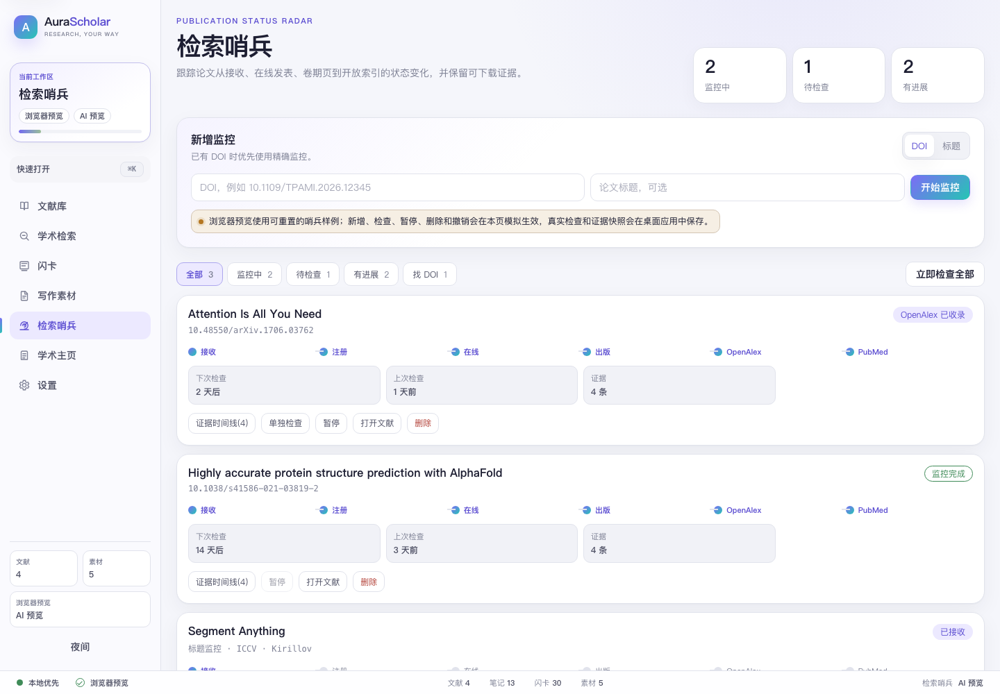

# AuraScholar

> An open-source research assistant for early-career researchers — discover, manage, read, connect, and cite, in one seamless workflow.

[](https://github.com/microbluey/AuraScholar/actions/workflows/ci.yml)
[](./LICENSE)

**English** | [简体中文](./README.zh-CN.md)

AuraScholar helps master's/PhD students, postdocs, and early-career faculty run their daily research as one smooth pipeline: from discovering papers, to managing and reading them, to reorganizing evidence and ideas on a spatial canvas, and to inserting citations while writing.



> The interface is currently Chinese-first.

> [!NOTE]
> **Project status: early development (alpha).** The core workflow works but is under active iteration — expect rough edges and breaking changes. Not recommended for managing your primary research library yet.

## Features

### 📚 Library workbench

- **Ingest from anywhere**: add papers by DOI / arXiv ID / URL / local PDF in one step; metadata is fetched automatically and open-access (OA) full text is downloaded when available. Local PDFs are matched back to their DOI from the body text.
- **Bulk migration**: import BibTeX / RIS / CSL-JSON from Zotero / EndNote, with automatic deduplication by DOI and a title+year+authors fingerprint.
- **Metadata sources**: aggregates five open data sources — Crossref, OpenAlex, Semantic Scholar, Unpaywall, and arXiv.

### 🔍 Academic search

- **Federated open-source search**: native aggregation across OpenAlex / Crossref / Semantic Scholar / arXiv with merged, deduplicated results, in-library markers, and one-click ingest (including OA PDF retrieval).
- **Built-in research browser**: open Google Scholar, Web of Science, Scopus, PubMed, CNKI, IEEE Xplore, ScienceDirect, SpringerLink, Wiley, ACM, JSTOR, ResearchGate, bioRxiv, DBLP, Baidu Scholar, Wanfang, VIP and more in in-app tabs (sites are customizable). Each site gets an isolated, persistent login session.
  - **Download-to-library**: PDFs downloaded on site (including via institutional subscriptions) and exported citation files are captured and ingested automatically.
  - **Arc-style tab archiving**: inactive tabs hibernate to free memory and restore instantly on click.
  - **Flexible networking**: per-site proxy settings (campus VPN and personal proxies coexist), plus library EZproxy prefixes to open paywalled articles with your institution's subscription.



### 📖 PDF reader

- Highlights, underlines, strikethroughs, sticky notes/comments, with multi-level text anchoring.
- Selection / page / full-document translation (LLM / DeepL / Baidu), with cached results to avoid repeat token costs.
- Three sidebar views: annotations · AI highlights · citation context.
- **Citation context graph**: presents citation relationships on a timeline instead of a hard-to-read citation tree.

### 🧠 Spatial canvas & AI synthesis

- **Multiple independent canvases**: separate research projects into their own workspaces. The canvas header switcher creates and switches canvases, while each workspace's `...` menu supports rename and safe deletion. Deletion requires confirmation, reports the card count, and always preserves at least one canvas; Library papers and PDF sources are never removed. Opening `/canvas` resumes the most recently used workspace at its RESTful `/canvas/:workspaceId` route, and existing default-canvas data is preserved as the first workspace.
- **Infinite research canvas**: place whole papers, PDF excerpts, researcher ideas, and AI synthesis results on one pannable, zoomable dot-grid canvas, with box selection, multi-select, relationships, collapsible groups, and a MiniMap.
- **Five built-in node types**: add a paper from the library or reader before making any excerpt; arrange paper, excerpt, AI synthesis, Markdown/LaTeX idea-note, and logical group nodes.
- **Canvas + reader split view**: open a paper or excerpt in an adjustable reader beside the canvas instead of losing the canvas context. The default desktop layout keeps roughly 60% for the canvas and 40% for the reader; excerpts open their anchored attachment, annotation, and page, with the full reader still available as a fallback.
- **Highlight-to-canvas workflow**: save a PDF highlight, then drag its excerpt chip onto the canvas or use **Add to current canvas**. AuraScholar creates an `ExcerptNode` and a `derived-from` edge from the source `PaperNode`; workspace, paper, source-node, and request identity checks prevent a stale reader operation from writing into another canvas.
- **Quick semantic relationships and source navigation**: in Select mode, hover or focus a card to reveal magnetic handles on its four sides. Drag from one card to another and choose **Cites**, **Supports**, **Contradicts**, or **Extends** from the inline pills—or press `1`–`4`; `Escape` cancels. Each source → target direction is deduplicated, while the reverse target → source relation remains valid. Custom relationships remain editable in the inspector, and excerpt cards retain their source anchor for later navigation.
- **Source-bounded AI synthesis**: select 2–10 paper or excerpt nodes to generate a methodology matrix, contradiction analysis, research-gap analysis, or concise synthesis. Paper nodes provide metadata and available abstracts—not full PDF text—while excerpt nodes provide selected source text. Results retain source nodes and provenance edges; actual generation requires a configured AI provider.
- **Library and reader intake**: adding a paper or excerpt goes directly to the only canvas when one exists; with multiple canvases, a lightweight picker defaults to the active canvas and can create a new target in place.
- **Local persistence**: the desktop app stores the canvas in SQLite, and whole-library JSON backups include canvas data. Spatial Canvas is not yet included in row-level WebDAV sync. Local PDFs are intentionally unavailable in the browser preview, so the split reader's real PDF workflow must be used in the desktop app. See the [Spatial Canvas product and architecture notes](./docs/SPATIAL_CANVAS_PRD.md) (Chinese).



### ✍️ Writing support

- **Writing snippets**: capture excerpts while reading, organized per paper, with notes and jump-back-to-source.
- **Citation formatting**: export APA 7th, GB/T 7714-2015, IEEE, Vancouver, MLA 9th, Nature, Chicago and more, plus BibTeX / RIS / CSL-JSON.
- **Word citation bridge** (planned): a built-in local service reserved for a future Word add-in — Zotero-style cite-while-you-write.

### 📡 Indexing sentinel

- Monitors each paper's journey from Accept → Online → Issue → database indexing, notifies you on every state change, and keeps evidence snapshots. Papers without a DOI can be tracked by title and are upgraded to DOI tracking automatically; published papers are ingested into the library on arrival.



### 🌐 Academic homepage / CV

- Syncs your published work, lets you edit your profile and select papers to feature, with live preview and exportable homepage and CV.

## Design principles

- **Local-first**: your data lives on your device (SQLite) and can be backed up anywhere.
- **Fully functional for free**: sync supported paper records, annotations, and indexing state through your own WebDAV endpoint, including WebDAV-compatible NAS or cloud storage (hybrid logical clocks + per-field LWW conflict resolution); Spatial Canvas currently moves between devices through whole-library JSON export/import. AI runs on your own model service and API key (OpenAI-compatible / Anthropic).
- **Pay for convenience**: official cloud sync, hosted AI, 24/7 cloud sentinel, and homepage hosting are optional paid services for users who prefer zero setup.
- **Two themes**: a calm scholarly "Dawn" light theme and a technical "Nocturne" dark theme.

## Project structure

```
apps/
  desktop/    # Electron desktop app (macOS / Windows / Linux)
  gallery/    # Dual-theme component gallery (design reference)
  web/        # PWA (SQLite WASM + OPFS, planned)
  mobile/     # Mobile (planned)
packages/
  tokens/     # Dual-theme design tokens
  ui/         # Component library (Radix + Tailwind)
  db/         # Drizzle ORM schema and migrations
  platform/   # Platform abstractions (HTTP / FS / notifications / keychain / scheduling)
  connectors/ # Crossref / OpenAlex / Semantic Scholar / Unpaywall / arXiv clients
  core/       # Domain logic: ingest pipeline, federated search, sentinel state machine, spatial canvas types, citation graph
  reader/     # PDF reader and annotation engine (multi-level anchoring)
  translate/  # Translation abstraction and providers (LLM / DeepL / Baidu)
  cite/       # CSL citation formatting, BibTeX/RIS import/export
  ai/         # AIProvider abstraction, BYOK implementations, and canvas synthesis
  sync/       # Sync engine (HLC + per-field LWW) and JSON backup/import remapping
  homepage/   # Homepage templates and CV generation
```

The desktop shell is Electron. Shared, platform-agnostic domain logic lives in `packages/`; Electron-specific orchestration and UI live in `apps/desktop/`. The Electron main process provides SQLite / CORS-free HTTP / file system / notifications / the built-in browser, bridged to the renderer through the preload `window.aura` API. See [apps/desktop/README.md](./apps/desktop/README.md) for the architecture.

## Development

```bash
pnpm install
pnpm build        # build all packages
pnpm test         # run tests

# Run the desktop app (Electron)
pnpm --filter @aurascholar/desktop rebuild:electron   # first run / after tests: switch native modules to the Electron ABI
pnpm --filter @aurascholar/desktop dev
```

The desktop app is pure JS/TS Electron — no Rust toolchain required. The only native dependency, `better-sqlite3`, needs different binary ABIs under Node (tests) and Electron (app): after `pnpm install` you're on the Node ABI (`pnpm test` just works); run `rebuild:electron` before starting the app, and `pnpm rebuild better-sqlite3` to switch back for tests. Packaging (`pnpm --filter @aurascholar/desktop package`) rebuilds for Electron automatically. See [apps/desktop/README.md](./apps/desktop/README.md) for details.

## Contributing

Issues and pull requests are welcome — see [CONTRIBUTING.md](./CONTRIBUTING.md).

## License

[AGPL-3.0-only](./LICENSE)
