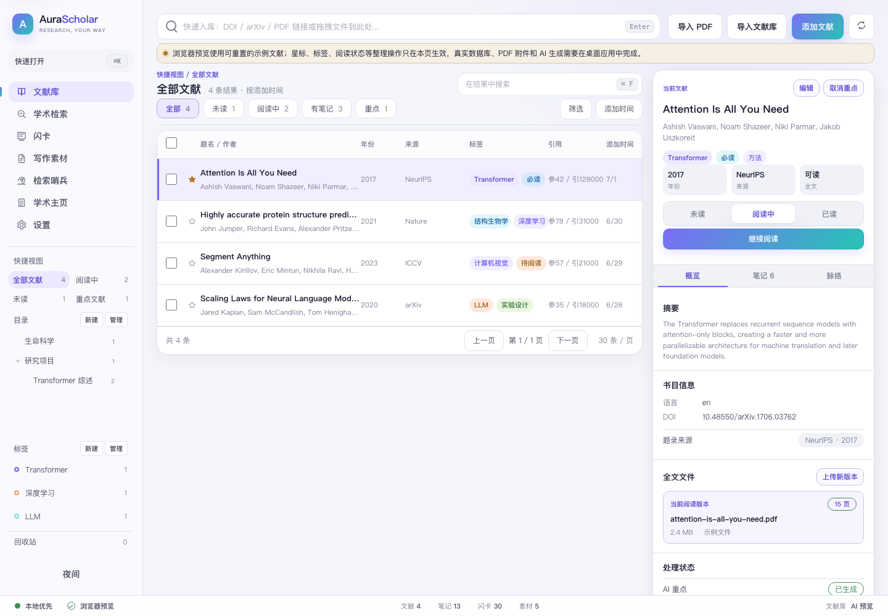
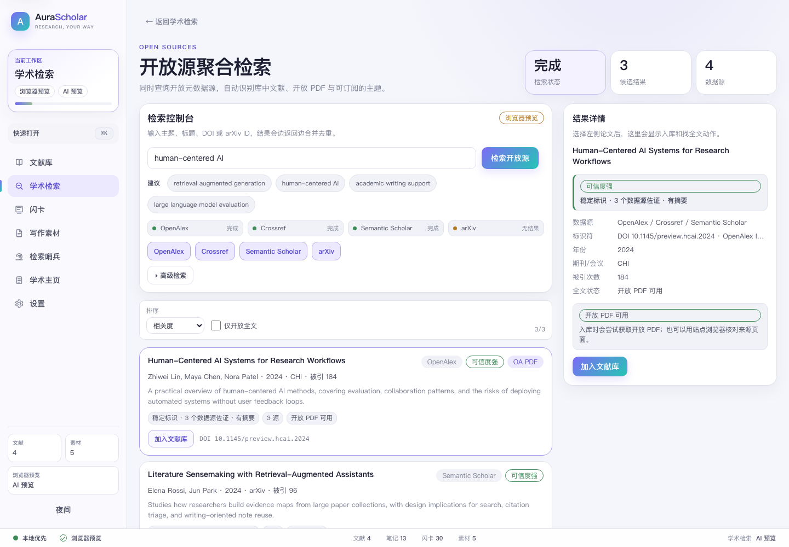
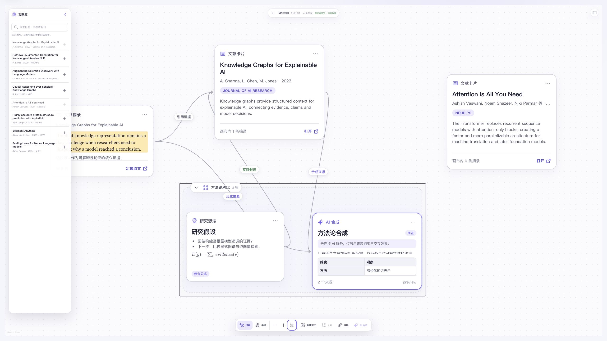
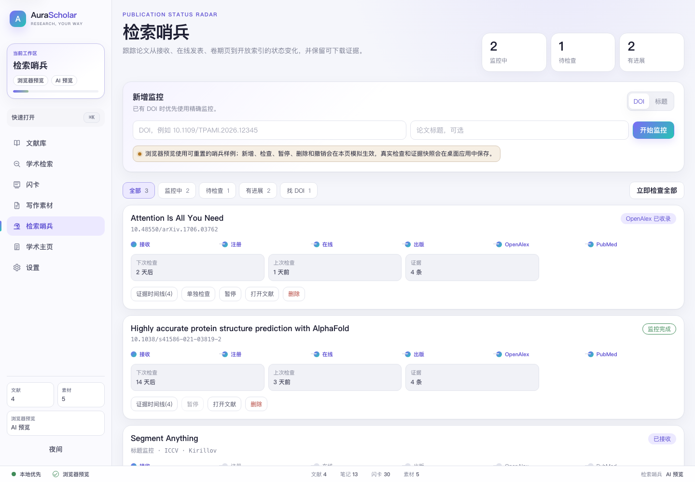

# AuraScholar

> 面向青年科研人员的开源科研助手 — 查找 · 管理 · 阅读 · 关联 · 写作引用,全流程一站式

[](https://github.com/microbluey/AuraScholar/actions/workflows/ci.yml)
[](./LICENSE)

[English](./README.md) | **简体中文**

AuraScholar 帮助硕士生、博士生、博士后与青年教师把日常科研串成一条顺滑的链路:从发现文献,到管理与阅读,再到在空间白板中重组证据与想法,最后在写作时插入引文。



> [!NOTE]
> **项目状态:早期开发中(alpha)。** 核心链路可用,但仍在快速迭代,可能有粗糙之处和不兼容变更;暂不建议把它作为你唯一的文献库管理工具。

## 功能

### 📚 文献工作台

- **多途径入库**:DOI / arXiv ID / 论文链接 / 本地 PDF 一键入库,自动抓取元数据并尝试下载开放获取(OA)全文;本地 PDF 会从正文识别 DOI 回填完整元数据。
- **批量迁移**:从 Zotero / EndNote 导入 BibTeX / RIS / CSL-JSON,按 DOI 与「标题+年份+作者」指纹自动去重。
- **元数据来源**:聚合 Crossref、OpenAlex、Semantic Scholar、Unpaywall、arXiv 五个开放数据源。

### 🔍 学术检索

- **开放源聚合检索**:OpenAlex / Crossref / Semantic Scholar / arXiv 原生聚合,结果去重合并、标记是否已在库,一键入库(含 OA PDF 获取)。
- **内置学术浏览器**:在应用内多标签打开 Google Scholar、Web of Science、Scopus、PubMed、CNKI、IEEE Xplore、ScienceDirect、SpringerLink、Wiley、ACM、JSTOR、ResearchGate、bioRxiv、DBLP、百度学术、万方、维普等常用站点(可增删自定义站点)。每个站点登录态独立隔离并持久保存。
  - **下载即入库**:在站内(含机构订阅)下载的 PDF / 导出的引用文件被自动捕获并入库。
  - **Arc 式标签归档**:长时间不活跃的标签自动休眠释放内存,点击秒级恢复到原页。
  - **网络灵活**:每个站点可单独走代理(校园网 VPN 与梯子互不干扰);支持图书馆 EZproxy 前缀,一键以学校订阅身份打开期刊全文。



### 📖 PDF 阅读器

- 高亮、下划线、删除线、便签/评论,多级文本锚定。
- 划词 / 整页 / 全文翻译(大模型 / DeepL / 百度),结果缓存避免重复消耗。
- 侧栏三视图:批注 · AI 重点 · 引文脉络。
- **引文脉络图**:以时间轴布局呈现引用关系,替代难读的传统引用树。

### 🧠 空间白板与 AI 合成

- **多个独立白板**:可将不同研究项目分开到独立工作区;画布顶部切换器支持新建和切换,每个白板的 `...` 菜单可重命名或安全删除。删除前会显示白板名称与卡片数并要求二次确认,系统始终保留至少一个白板,且绝不删除文献库论文与 PDF 源文件。打开 `/canvas` 会恢复最近使用的白板,并进入 RESTful 路由 `/canvas/:workspaceId`;旧版默认白板数据会作为第一个工作区保留。
- **无限研究画布**:把完整文献、PDF 摘录、研究想法与 AI 合成结果放入同一张可缩放、可平移的点阵画布;支持框选、多选、拖动、直接连线与可折叠分组。
- **五类内置节点**:无需先做摘录即可从文献库或阅读器加入整篇文献;当前支持文献、摘录、AI 合成、Markdown/LaTeX 研究想法和逻辑分组节点。
- **分层画布控件**:底部浮动 Dock 只保留文献库、统一新建菜单与指针工具;缩放、适配和按需挂载的 MiniMap 位于右下导航岛。分组、整理、AI 合成和批量移除只在多选后浮现于选区上方,不再让无关或禁用操作长期占据工具栏。
- **直接操作卡片与连线**:普通单击文献或摘录会打开同屏阅读器,AI 合成与分组仍进入左侧详情面板。研究笔记就在卡片上编辑:点击标题或 Markdown 正文即可直接输入,空间不足时可展开为支持源码、分屏、预览、GFM/LaTeX、格式工具与 `Cmd` / `Ctrl` + `S` 保存的专注编辑器。单击连线只选择它,真实指针双击可就地编辑可选的自由文字,键盘仍可用 `F2`。鼠标右键、触摸板双指点击或卡片 `...` 可打开上下文操作。`Shift` / `Cmd` / `Ctrl` + 单击仍只用于多选。
- **可恢复的本机笔记草稿**:专注 Markdown 编辑器会按白板、节点与窗口 revision 在当前设备自动保存草稿,刷新页面或异常退出后仍可恢复尚未提交的研究笔记,多个标签页也不会互相覆盖。存在修改时关闭编辑器或离开当前页面会提供「保存并关闭」「放弃修改」「继续编辑」三种选择;恢复和保存都会重新校验白板、节点与基础内容版本,不会静默覆盖更新后的笔记。这类恢复草稿仅保存在本机,暂不通过 WebDAV 同步。
- **有保护的键盘删除**:画布本身聚焦时,按 `Delete` / `Backspace` 可移除选中的画布节点或连线;正在输入、使用弹窗/菜单或操作阅读器时快捷键不会生效。删除分组只移除外壳并保留子卡片,移除任何画布卡片都不会删除文献库论文或 PDF 源文件。
- **白板级撤销与重做**:按 `Cmd` / `Ctrl` + `Z` 撤销,按 `Cmd` + `Shift` + `Z` 或 `Ctrl` + `Y` / `Ctrl` + `Shift` + `Z` 重做。每个白板在当前会话内独立保留最近 50 步,切换白板不会串栈;连续拖动和快速字段编辑会合并,视口导航与分组显隐不入栈,输入框仍使用原生文本撤销。相同操作也可在“指针”菜单中找到。
- **画布指令面板**:按 `Cmd` / `Ctrl` + `K` 可按题名、作者、期刊、年份或标签检索完整文献库,并在最近的画布指针位置创建 `PaperNode`;选择已加入当前白板的文献时会直接定位,若它位于折叠分组中则自动展开,不会重复创建。输入 `/ai` 只会显示现有四种有来源边界的合成操作,不是自由对话入口。
- **混选整理与文献专用布局**:选择至少两张处于同一层级的卡片,可通过选区浮条、多选右键菜单或 `Cmd` / `Ctrl` + `Shift` + `L`,把文献、摘录、笔记、AI 合成与分组容器按当前阅读顺序和真实尺寸整理为不重叠网格;分组被选中时会作为一张整体卡片移动,其已选子卡不会重复位移。全部为 `PaperNode` 时,还可按发表年份或引文结构排布。引用树会先读取本地 Library 引文关系;桌面端在需要时复用引文脉络缓存,或按所选 DOI 从 OpenAlex 补充关系。这些关系只作为临时布局输入,不会把手工连线改成引文,也不会偷偷创建画布连线。循环引用的文献会保持在同一列;选区/白板指纹与请求取消会阻止过期图谱移动错误白板。
- **白板 + 阅读器同屏分屏**:单击文献卡或摘录卡即可在白板右侧的可调阅读器中打开,避免切走白板后丢失研究上下文。桌面端默认约为白板 60%、阅读器 40%;摘录会定位到对应附件、批注与页码,同时保留进入完整阅读器的入口。
- **高亮拖入白板**:保存 PDF 高亮后,可把摘录条拖到白板,也可点击「加入当前白板」。系统会创建 `ExcerptNode`,并从来源 `PaperNode` 自动建立来源连线;工作区、文献、来源节点及请求身份都会被校验,避免旧阅读请求跨白板写入。
- **直接磁吸连线与关联笔记**:悬停或聚焦卡片即可显示四向磁力连接点;拖到另一张卡片会立即连上,不再选择任何关系类型。拖到空白处则在落点原子创建一张空白 `IdeaNoteNode` 并连接来源,不会再弹出已有节点选择器。新连线默认没有文字,双击即可写入或清空任意标签。按 `Escape` 或切换白板会安全取消未完成手势;同一来源 → 目标方向只保留一条连线,反向连线仍可独立建立。
- **有来源边界的 AI 合成**:选择 2–10 张文献或摘录节点,生成方法论对比、分歧分析、研究空白或简明综述。文献节点只提供题录与可用摘要,而非 PDF 全文;摘录节点提供所选原文。异步结果写入前会重新校验请求、白板以及每个来源节点的 ID、类型与内容版本,旧请求不能生成悬空来源连线。结果保留来源节点与来源连线,实际生成需要配置 AI 服务。
- **文献库与阅读器加入**:只有一个白板时,文献或摘录会直接加入;存在多个白板时,轻量选择器默认选中当前活跃白板,也可就地新建目标白板。
- **本地持久化**:桌面端将白板保存到 SQLite,整库 JSON 备份包含白板数据;空间白板暂未纳入 WebDAV 行级同步。浏览器预览有意不读取本机 PDF,同屏阅读的真实 PDF 工作流需在桌面应用中使用。详见[空间白板产品与架构说明](./docs/SPATIAL_CANVAS_PRD.md)。



### ✍️ 写作支持

- **写作素材**:阅读时随手摘录,按论文归类,可加备注、跳回原文。
- **引文格式化**:导出 APA 7th、GB/T 7714-2015、IEEE、Vancouver、MLA 9th、Nature、Chicago 等多种样式,以及 BibTeX / RIS / CSL-JSON。
- **Word 引用桥**(规划中):应用内置本地服务,为未来的 Word 加载项预留接口,实现类 Zotero 的"边写边引"。

### 📡 检索哨兵

- 自动监控论文从 Accept → Online → 正式出版 → 数据库收录的全过程,状态变化即时通知,并保存证据快照;无 DOI 的论文支持按标题监控,命中后自动升级为 DOI 跟踪,出版后自动入库。



### 🌐 个人学术主页 / CV

- 自动同步已发表成果,编辑个人资料,选择展示论文,实时预览并导出可分享的主页与简历。

## 设计理念

- **本地优先**:数据存在你自己的设备上(SQLite),可备份到任意位置。
- **全功能免费**:文献记录、批注与检索状态可通过自己的 WebDAV 服务同步,也可使用提供 WebDAV 接口的 NAS 或网盘(混合逻辑时钟 + 逐字段 LWW 冲突解决);空间白板当前通过整库 JSON 备份迁移。AI 使用你自己的模型服务与 API Key(OpenAI 兼容 / Anthropic)。
- **付费买省心**:官方云同步、官方 AI 服务、7×24 云端哨兵与主页托管,作为可选会员服务,供不想折腾的用户使用。
- **双主题**:日间「Dawn」学术极简冷淡风,夜间「Nocturne」极客暗黑科技风。

## 项目结构

```
apps/
  desktop/    # Electron 桌面应用(macOS / Windows / Linux)
  gallery/    # 双主题组件画廊(设计参照)
  web/        # PWA(SQLite WASM + OPFS,规划中)
  mobile/     # 移动端(规划中)
packages/
  tokens/     # 双主题设计令牌
  ui/         # 组件库(Radix + Tailwind)
  db/         # Drizzle ORM schema 与迁移
  platform/   # 平台能力抽象(HTTP / FS / 通知 / 钥匙串 / 调度)
  connectors/ # Crossref / OpenAlex / Semantic Scholar / Unpaywall / arXiv 客户端
  core/       # 领域逻辑:入库管线、聚合检索、哨兵状态机、空间白板模型、引文图谱
  reader/     # PDF 阅读器与批注引擎(多级锚定)
  translate/  # 翻译抽象与实现(大模型 / DeepL / 百度)
  cite/       # CSL 引文格式化、BibTeX/RIS 导入导出
  ai/         # AIProvider 抽象、BYOK 实现与空间白板 AI 合成
  sync/       # 同步引擎(HLC + 逐字段 LWW)与 JSON 备份导入重映射
  homepage/   # 主页模板与 CV 生成
```

桌面壳采用 Electron。共享且平台无关的领域逻辑位于 `packages/`,Electron 专属编排与 UI 位于 `apps/desktop/`。Electron 主进程提供 SQLite / 无 CORS HTTP / 文件系统 / 通知 / 内置浏览器,经 preload 的 `window.aura` 桥接给渲染进程。架构详见 [apps/desktop/README.md](./apps/desktop/README.md)。

## 开发

```bash
pnpm install
pnpm build        # 构建所有包
pnpm test         # 运行测试

# 启动桌面应用(Electron)
pnpm --filter @aurascholar/desktop rebuild:electron   # 首次/跑过测试后:把原生模块切到 Electron ABI
pnpm --filter @aurascholar/desktop dev
```

桌面端是纯 JS/TS 的 Electron 应用,无需 Rust 工具链。唯一的原生依赖
`better-sqlite3` 在 Node(测试)与 Electron(应用)下需要不同的二进制 ABI,
不能共存:`pnpm install` 后默认是 Node ABI(`pnpm test` 可直接跑),跑应用前用
`rebuild:electron` 切换;若之后要再跑测试,执行 `pnpm rebuild better-sqlite3`
切回。打包(`pnpm --filter @aurascholar/desktop package`)会自动为 Electron
重编。详见 [apps/desktop/README.md](./apps/desktop/README.md)。

## 参与贡献

欢迎 Issue 与 PR,请见 [CONTRIBUTING.md](./CONTRIBUTING.md)。

## License

[AGPL-3.0-only](./LICENSE)
